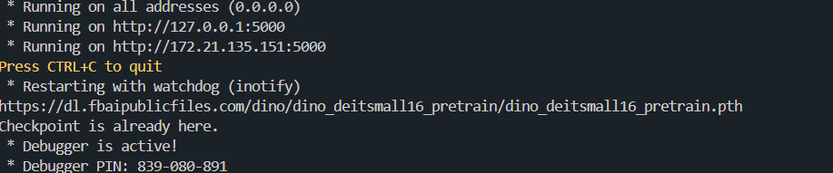

https://github.com/OML-Team/open-metric-learning 참고해주세요.

# 검색모델 실행 방법
1. pip install -U open-metric-learning 
2. python 3.8 이상 설치
3. pytorch 1.7 이상 설치
4. goods 파일에 로드할 데이터(jpg)를 넣고 real.json 을 적절히 수정합니다.
5. makingembeddings.ipynb 파일에서 데이터 로드부분을 수정하고 로드하여 임베딩 파일을 생성합니다.(예시: embeddings.npz)

6. 터미널 에서 RESTAPI.py 가 위치한 폴더에서 'python RESTAPI.py' 입력 및 실행합니다.

이렇게 떠야 정상입니다.

--파일 설명--
makingembeddings.ipynb 는 기존 backbone model 에서 우리팀의 데이터셋을 로드 및 적용하는 부분입니다. 임베딩 파일을 만들어내는 파일입니다.

RESTAPI.py 검색모델 백앤드 -- 임베딩파일을 로드하면 코사인유사도로 비슷한 이미지 찾아줍니다.

static폴더는 정적파일들이 모여있습니다.
